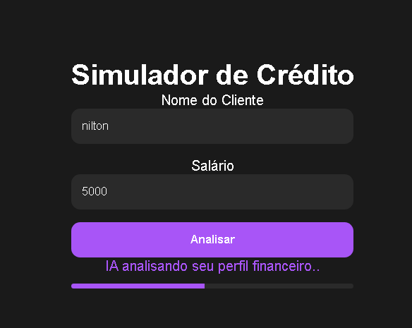
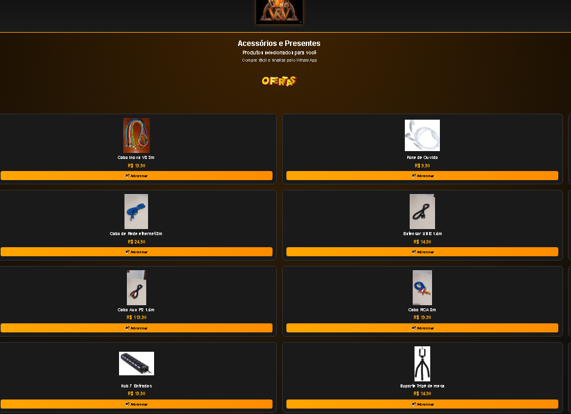

👋 Olá, me chamo Nilton

💻 Estudante de programação
🚀 Construindo projetos práticos com JavaScript, lógica de negócio e interfaces web

---

🧠 Projetos em destaque

- 💰 Simulador de Crédito
  Sistema que calcula parcelas com base em juros compostos e regras de negócio e validaçao de valores

- 🛒 Mini Loja Virtual
  Interface de e-commerce com fluxo de navegação e interação do usuário em javscript

- 📊 MVP Neurofoco
  Protótipo de plataforma com foco em aprendizado baseado em Neuroplasticidade

---

🛠 Tecnologias

- HTML
- CSS
- JavaScript

---

🎯 Objetivo

Buscando oportunidade de estágio para aplicar meus conhecimentos em projetos reais, evoluindo como desenvolvedor e contribuindo com soluções práticas.

---

 🔗 Projetos

  <a href="https://euniltonvelasco.github.io/simulador-de-credito/">
    <strong>💰 Simulador de Crédito</strong>
  </a>

  

  <a href="https://euniltonvelasco.github.io/loja-virtual-1.0/">
    <strong>🛒 Mini Loja Virtual</strong>
  </a>

  

  <a href="https://euniltonvelasco.github.io/neurofoco_1.0/">
    <strong>🧠 Neurofoco</strong>
  </a>

  

